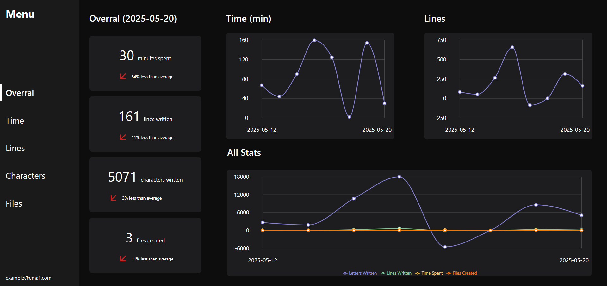

# 📈 Coding Statistics Extension for VS Code

**Coding Statistics** is a Visual Studio Code extension that tracks your coding activity and sends the statistics to a custom API. Ideal for developers who want to monitor their productivity, editor usage, and file management.

  

---

## ⚙️ Features

- **Lines Written**: Tracks the number of lines of code written.
- **Characters Typed**: Counts the number of characters typed in your code.
- **Files Created**: Monitors the number of files created during your coding sessions.
- **Total Editor Usage Time**: Tracks how long you've spent coding in the editor.
- **Automatic Data Submission**: Sends your statistics to the API automatically when VS Code is closed.
- **Email Authentication**: Links your statistics to your user email for easy identification.
- **Reconnection Logic**: Automatically tries to reconnect to the API if the connection drops.
- **Status Bar Interaction**: Click the statistics display in the VS Code status bar to open the web dashboard with your coding stats.

---

## 🔧 Setup

1. **Email Verification**: When using the extension for the first time on a new machine, you will need to verify your email.
2. **Git Configuration**: Ensure that your Git configuration has a `user.email` set, as the email is required for authentication.

---

## 🐞 Known Issues

- The email capture may fail if your Git configuration (`user.email`) is not set.

---

## 📦 Release Notes

### 1.2.0

- Added reconnection logic to handle temporary API outages more gracefully.
- Clicking the status bar display now opens the web dashboard with your personal statistics.
- Added image preview of the stats dashboard in the README.

### 1.1.2

- Introduced email-based authentication for better security.

### 1.0.3

- Fixed a bug where switching branches caused inaccurate tracking.

### 1.0.2

- Added display of statistics in the **VS Code status bar** for quick viewing.

### 0.0.2 – 0.0.3

- Improvements to the counting mechanism for lines and characters written.

### 0.0.1

- Initial release with the following features:
  - Tracks lines written, characters typed, and files created.
  - Tracks total coding time.
  - Automatic submission of stats to the custom API on VS Code shutdown.

---

## 📬 Feedback

Have suggestions, questions, or found a bug?  
Feel free to open an [issue](https://github.com/PedroKleinDavila/statistics-extension/issues) or submit a [pull request](https://github.com/PedroKleinDavila/statistics-extension/pulls)!

---

## ✨ Contribution

We welcome contributions to improve the extension. Please fork the repository, make changes, and submit a pull request!

---