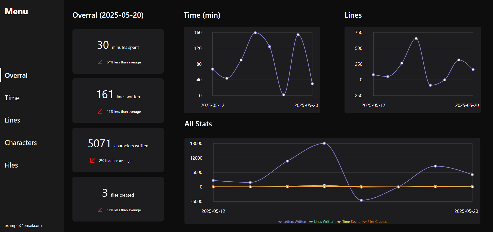

# 📈 Coding Statistics Extension for VS Code

**Coding Statistics** is a Visual Studio Code extension that intelligently tracks your coding activity with granular detail. Monitor your productivity across projects and languages, with comprehensive statistics sent to a custom analytics API.

<p align="center">
  
</p>

---

## What's New in Version 2

This is a **major refactor** with a completely new architecture. Version 2 introduces:

- **Project & Language Segmentation**: Track statistics separately for each project and programming language.
- **AI-Assisted Coding Detection**: Distinguish between manual edits, AI-assisted changes (e.g., GitHub Copilot), and bulk edits.
- **Advanced Line Tracking**: Detailed breakdown of lines added, deleted, and modified across different edit types.
- **Improved Activity Detection**: Better window state awareness and real-time context tracking.
- **Enhanced Status Bar Display**: Live statistics showing total time, lines written, language breakdown, and project focus.

---

## ⚙️ Features

- **Project-Based Statistics**: Automatically track coding metrics per project with intelligent project detection.
- **Language-Specific Tracking**: Segmented statistics for each programming language you use.
- **Granular Line Metrics**: Track lines written with categorization:
  - **Manual Edits**: Lines you write directly.
  - **Assisted Edits**: Lines added via AI assistants (Copilot, etc.).
  - **Bulk Operations**: Paste operations and multi-line changes.
- **Real-Time Status Bar**: Live dashboard in the VS Code status bar showing:
  - Total coding time
  - Total lines written
  - Current language with time spent
  - Current project with time spent
- **Smart Git Integration**: Automatically detects branch switches to prevent inaccurate tracking.
- **Window State Awareness**: Tracks only active coding time, ignoring inactive periods.
- **Email-Based Identity**: Links your statistics to your email for cross-device tracking.
- **API Integration**: Sends statistics to a custom backend for long-term analysis and dashboard viewing.

---

## 🔧 Setup

1. **Git Configuration**: Ensure your Git configuration has a `user.email` set, as it's used to identify your coding sessions.
   ```bash
   git config user.email "your-email@example.com"
   ```
2. **Install the Extension**: Download and install the extension from the VS Code Marketplace.
3. **First Launch**: The extension will automatically initialize on VS Code startup and begin tracking your activity.
4. **View Your Stats**: Check the status bar for real-time statistics, or visit your dashboard for detailed analysis.

---

## 🐞 Known Issues

- The email capture may fail if your Git configuration (`user.email`) is not set. Please ensure it's configured before using the extension.

---

## 📦 Release Notes

### 2.0.0 – Major Release

**Complete Rewrite with New Architecture**

- Introduced **project-based tracking**: Statistics now segmented by project.
- Introduced **language-specific tracking**: Track productivity by programming language.
- Implemented **granular edit detection**: Distinguish between manual, assisted, and bulk edits.
- Enhanced **status bar display** with live, real-time metric updates.
- Added **Git branch awareness** to improve accuracy when switching branches.
- Improved **window state detection** for better activity tracking.
- New internal architecture using event-driven patterns and better state management.
- Better error handling and validation.

### 1.2.1

- Added reconnection logic to handle temporary API outages.
- Improved status bar user interface.

### 1.1.2

- Introduced email-based authentication for user identification.

### 1.0.0 – Initial Release

- Basic line and character tracking.
- Total editor usage time monitoring.
- Automatic data submission to API.

---

## 📬 Feedback

Have suggestions, questions, or found a bug?  
Feel free to open an [issue](https://github.com/PedroKleinDavila/statistics-extension/issues) or submit a [pull request](https://github.com/PedroKleinDavila/statistics-extension/pulls)!

---

## ✨ Contributing

We welcome contributions to improve the extension. Please fork the repository, make changes, and submit a pull request. For major changes, please open an issue first to discuss your ideas.-

---