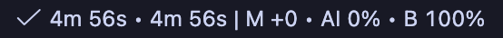
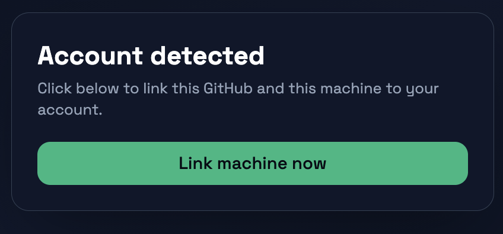
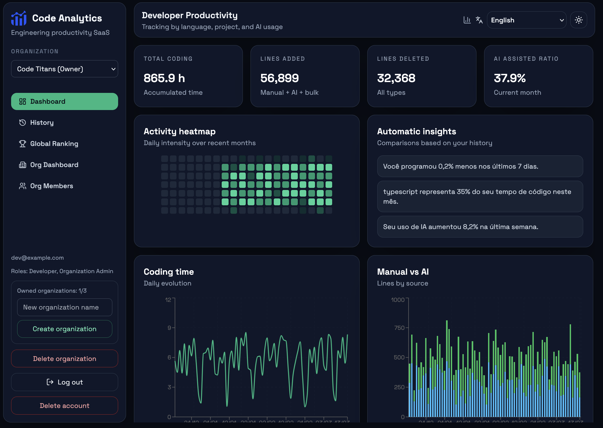
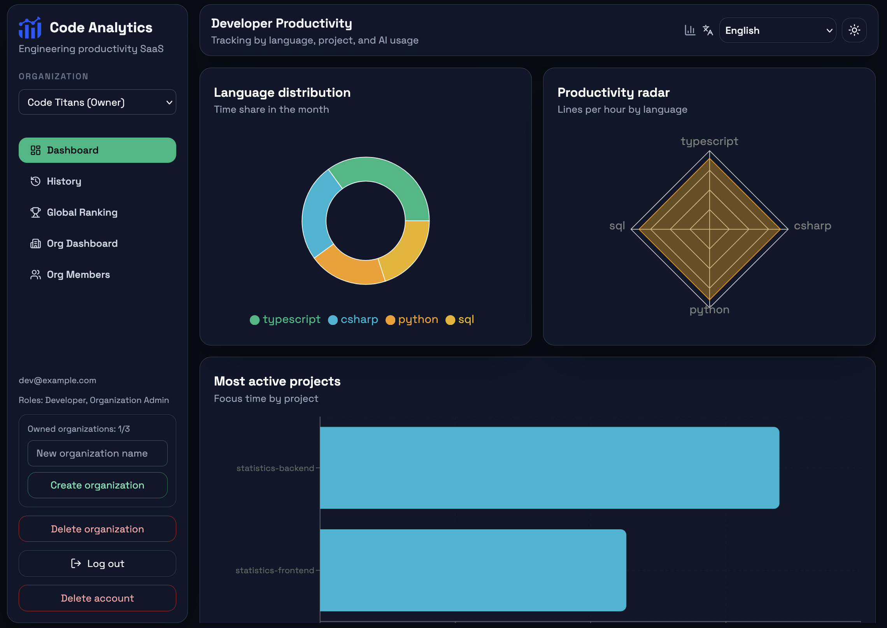
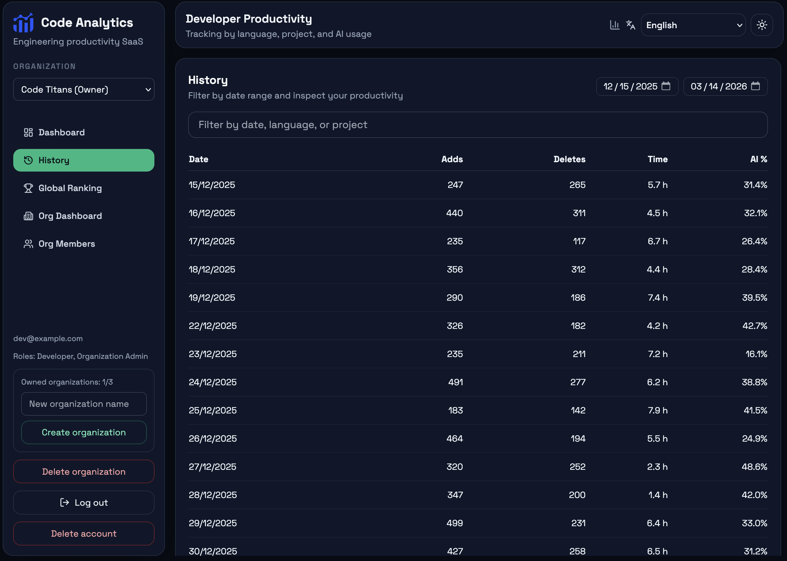
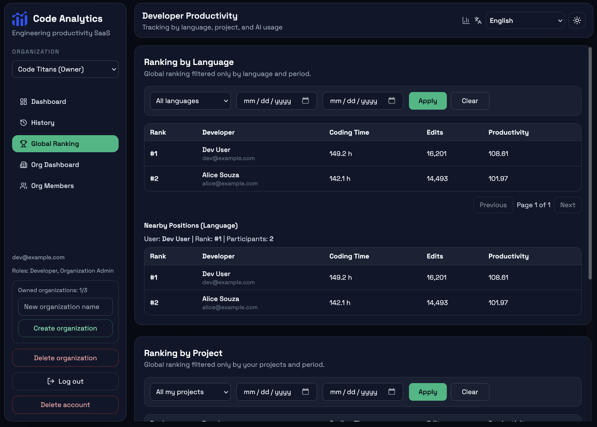

# Coding Statistics VS Code Extension

Coding Statistics is a VS Code extension that tracks your coding activity in real time and syncs it to the CodingStats platform.

This README reflects the current production architecture across all related repositories:

* `statistics-extension` (VS Code extension)
* `statistics-extension-backend-2` (.NET API + persistence)
* `statistics-extension-frontend-2` (web dashboard and account flows)

---

# Screenshots

## Status Bar

Shows real-time coding metrics directly inside VS Code.



---

## Link Account Page

When the extension cannot authenticate, it opens the account linking page.



---

## Dashboard Overview

The dashboard aggregates coding metrics, insights and activity heatmaps.



---

## Language & Project Statistics

Breakdown of coding activity by language and project.



---

## History Page

View detailed historical activity over a custom date range.



---

## Global Rankings

Compare your coding activity with other developers.



---

# What The Extension Tracks

The extension captures, per language and per project:

* Coding time (active editor time only)
* Manual edits (`manualAdd`, `manualDelete`)
* Assisted edits (`assistedAdd`, `assistedDelete`)
* Bulk edits (`bulkAdd`, `bulkDelete`)

Edit classification logic:

* `bulk`: more than 5 lines touched OR more than 200 chars touched
* `assisted`: more than 1 line touched OR more than 50 chars touched (when not bulk)
* `manual`: everything else

---

# End-to-End Flow (Extension -> Backend -> Frontend)

1. On startup, extension initializes local state and detects:

   * GitHub primary verified email (VS Code GitHub auth)
   * `vscode.env.machineId`

2. Extension calls `POST /auth/login-extension`.

3. If backend returns `USER_NOT_FOUND` (404), extension opens:

```
https://codingstats.me/login?githubEmail=...&machineId=...
```

4. User logs in/registers in frontend and frontend calls `POST /auth/link-machine`.

5. Extension retries login every 60s until authenticated.

6. Extension tracks activity locally in workspace state.

7. Every 10 minutes, extension snapshots local counters and queues them.

8. Queue is sent to backend via `POST /stats` (JWT bearer token).

9. After upload, extension fetches merged daily server state via `GET /stats/{date}`.

10. Status bar shows live totals = local unsynced + latest synced daily totals.

---

# Reliability Model

* Local queue is persisted in `globalState` by day (`pendingStatisticsByDay`)
* Queue items from same day are merged
* If auth expires (401), extension invalidates session and restarts login
* If network/server fails, pending queue is kept and retried
* On deactivate, extension forces a final sync cycle (`syncNow`)

---

# Status Bar

Main command:

* `Coding Statistics: Open CodingStats Dashboard`

Display modes (`codingstatistics.statusBar.mode`):

* `compact`
* `balanced`
* `deep`

Primary metric (`codingstatistics.statusBar.primaryMetric`):

* `time`
* `manualLines`
* `netLines`
* `assistedShare`
* `productivityScore`

Time format (`codingstatistics.statusBar.timeFormat`):

* `human`
* `hhmmss`
* `minutes`

Sync icons are dynamic (`check`, `sync~spin`, `cloud-offline`, `warning`, `pulse`) based on auth and pending queue status.

---

# Extension Settings

* `codingstatistics.apiUrl` (default: `https://api.codingstats.me`)
* `codingstatistics.statusBar.mode`
* `codingstatistics.statusBar.primaryMetric`
* `codingstatistics.statusBar.timeFormat`

---

# Setup

1. Configure Git email (used for extension identity)

```
git config user.email "your-email@example.com"
```

2. Install extension.

3. Open VS Code and start coding.

4. Click the extension status bar item to open the dashboard.

---

# Known Limitation

If GitHub email or machine ID is unavailable, data stays local until authentication can be completed.
